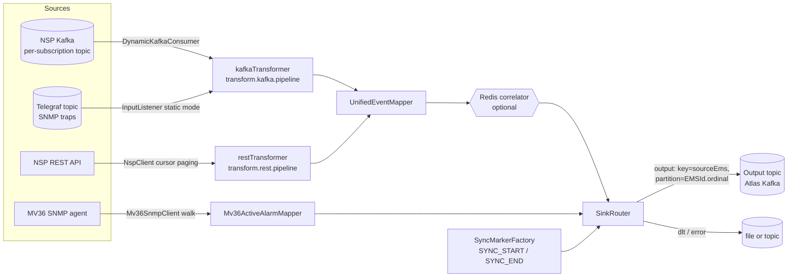
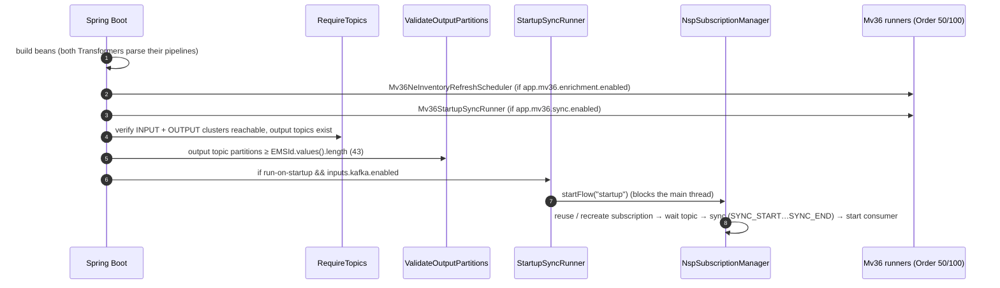
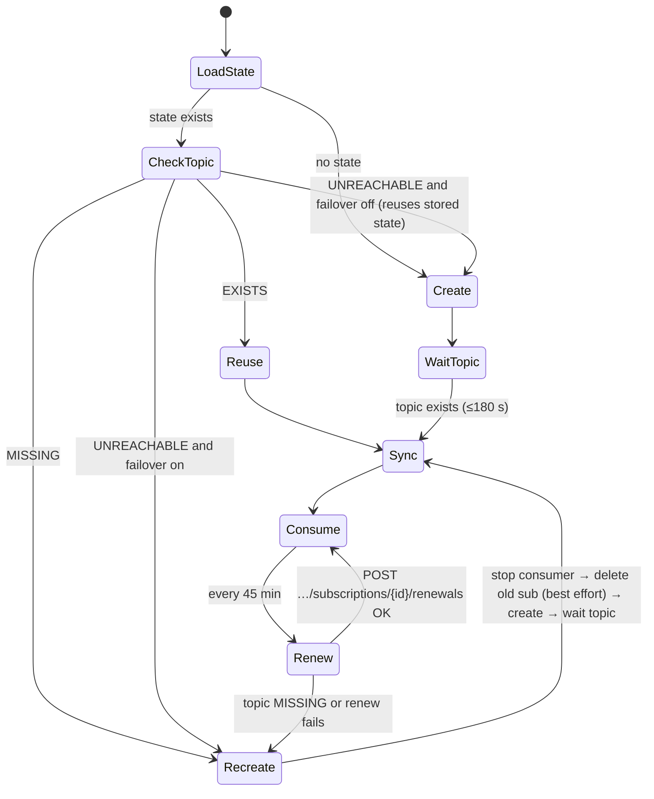

# rdnoc-alarm-app — How It Works

> Living reference for the application's architecture, data flows and known risks.
> Written from a full read of every source file (branch state as of 2026-09-29, HEAD `2f39a51 OMS 1350 Timezone Fix`).
> Behaviour marked **✔ verified** was confirmed by running the real classes against sample payloads (see [§14](#14-how-this-document-was-verified)).

---

## Contents

1. [Purpose & big picture](#1-purpose--big-picture)
2. [Deployment model — one jar, many EMS instances](#2-deployment-model--one-jar-many-ems-instances)
3. [Tech stack](#3-tech-stack)
4. [Package map](#4-package-map)
5. [Startup sequence](#5-startup-sequence)
6. [Flow A — Kafka (real-time)](#6-flow-a--kafka-real-time)
7. [Flow B — Sync (periodic snapshot)](#7-flow-b--sync-periodic-snapshot)
8. [NSP subscription lifecycle & site failover](#8-nsp-subscription-lifecycle--site-failover)
9. [The transform pipeline engine](#9-the-transform-pipeline-engine)
10. [UnifiedEventMapper — per-EMS mapping rules](#10-unifiedeventmapper--per-ems-mapping-rules)
11. [Output: UnifiedEvent, partitioning, markers, sinks](#11-output-unifiedevent-partitioning-markers-sinks)
12. [Supporting features (Redis correlation, MV36 enrichment, scheduling)](#12-supporting-features)
13. [Findings & risks](#13-findings--risks)
14. [How this document was verified](#14-how-this-document-was-verified)
15. [Configuration reference](#15-configuration-reference)
16. [Instance configurations (the per-EMS ymls)](#16-instance-configurations-the-per-ems-ymls)

---

## 1. Purpose & big picture

The app collects alarms from NOC element-management systems (EMS), runs them through an ETL step, and writes one
normalised **`UnifiedEvent`** JSON record per alarm to an **output Kafka topic**. That topic is read by the downstream
monitoring platform (Atlas).

There are two ingestion flows, and both end at the same mapper and the same output topic:

| Flow | Trigger | Source | Output `type` |
|---|---|---|---|
| **Kafka (real-time)** | continuous | NSP notification topic (dynamic) **or** a fixed topic fed by Telegraf SNMP traps (static) | `FAULT`, `CHANGE`, `CLEAR`, `EVENT`, … |
| **Sync (snapshot)** | on startup and then every N hours | NSP REST API (active alarms) **or** MV36 SNMP table walk | `SYNC_START`, then `FAULT_SYNC` × N, then `SYNC_END` |



---

## 2. Deployment model — one jar, many EMS instances

The same jar serves **every EMS type**. Each deployment chooses its behaviour through an external config file:

- The Docker `ENTRYPOINT` runs with `--spring.config.additional-location=optional:file:/app/config/`, so a per-instance
  `application.yml` in `/app/config` overrides the bundled one.
- The **bundled** `src/main/resources/application.yml` is the **NSP / ATNOI** instance, running in dynamic Kafka mode with NSP REST sync.
- Other instances (MV36, TNMS, Nokia 1350, ExaGrid, NFM‑T) switch to `app.kafka.mode=static`, set `app.kafka.input-topic`,
  point their Kafka pipeline at Telegraf JSON (`fields`/`tags`), and set `sourceEms` in the pipeline so that
  `UnifiedEventMapper` routes to the right branch.

The EMS types the code knows about, and how each one gets data in:

| EMS (`EMSId`) | Real-time path | Sync path | Mapper branch |
|---|---|---|---|
| `NSP_ATNOI` | dynamic NSP subscription topic | NSP REST | NSP/ATNOI (default) |
| `NOKIA_NFM_T` (WSNOC) | NSP-style notifications | NSP-style REST | NFM‑T |
| `MV36_MOBILE`, `MV36_FIXED_A/B/C` | Telegraf trap topic (static) | MV36 SNMP walk | Telegraf → MV36 |
| `INFINERA_TNMS` | Telegraf (static) | — | Telegraf → TNMS/generic |
| `NOKIA_1350_EML1/EML2/OTNE/PKT` | Telegraf (static) | — | Telegraf → OMS 1350 |
| `EXAGRID` | Telegraf (static) | — | Telegraf → ExaGrid |

> **Important: instance ymls are *overlays*, not replacements.** With `additional-location`, the bundled
> `application.yml` + `application.properties` are still loaded underneath:
> - **Maps merge key-by-key.** For example, `spring.kafka.consumer.properties` inherits any key the instance doesn't set.
> - **Lists replace.** `transform.*.pipeline` is swapped out wholesale.
>
> That is why MV36 or ExaGrid instances start without defining `app.rest.nsp.host` or `state-file`: they inherit NSP values
> they never use. It also causes the WSNOC truststore problem in [§16](#16-instance-configurations-the-per-ems-ymls).
> A file named `application-<x>.yml` in `/app/config` is only loaded when profile `<x>` is active, or when it is mounted as `application.yml`.

CI (`.github/workflows/ci.yml`) builds the image on every push, pushes it to GHCR, and on `main` deploys a single
container called `kafka-app` over SSH. Only `~/kafka-app/config` is mounted, read-only (see [§13 R6](#r6)).

---

## 3. Tech stack

- **Java 25**, **Spring Boot 4.1.0** (Spring 7), **Jackson 3** (`tools.jackson.*`), Spring Kafka 4.1 / kafka-clients 4.2
- `spring-boot-starter-data-redis` (optional correlation), `snmp4j 3.8.2` (MV36), `commons-text` (template step), Lombok
- Actuator + Prometheus (`/actuator/health|metrics|prometheus|env|info`)
- **No tests** in `src/test`.

---

## 4. Package map

```
gr.ote.atlas.events.*            ← shared "Atlas" contract (normally a separate library, vendored here)
  enums/        EMSId (43 values → output partition index), EMSVendorID, EMSDomain, EventType, Severity
  models/       UnifiedEvent, EnrichedData, AffectedLocation, TransportEnrichment
  emsspecificevents/  SystemSpecificEvent (+@type polymorphism) and per-vendor payload classes
  enrichment/   NeNameEnricher (unused — logic duplicated in NeNameEnrichmentStep)

gr.ote.rdnoc.alarm
  KafkaApplication               main; @EnableKafka, @ConfigurationPropertiesScan
  boot/        RequireTopics (cluster/topic checks), ValidateOutputPartitionsOnStartup
  config/      RestClientConfig (10 s connect / 60 s read), SchedulingConfig
  kafka/       DynamicKafkaConsumer (NSP runtime topic), InputListener (static @KafkaListener),
               KafkaListenerController, KafkaErrorHandlingConfig, KafkaAdminClientsConfig, KafkaProducers (unused)
  nsp/         NspClient (REST: token, alarms, subscriptions), NspSubscriptionManager (lifecycle),
               NspSiteSelector (failover), NspRestPoller (sync publish), FileSubscriptionStateStore
  sync/        StartupSyncRunner, SyncScheduler, SubscriptionRenewScheduler, SyncCoordinator (NSP)
  mv36/        SNMP client, NE inventory client + cache, enrichment service, mapper, sync coordinator/schedulers
  service/     Transformer + pipeline steps, TransformProperties, SinksProperties, CorrelationProperties,
               SyncMarkerFactory/Properties, errors
  atlas/       UnifiedEventMapper (≈1.4k lines — the heart of the ETL)
  correlate/   RedisAlarmInstanceCorrelator (used), TnmsRedisAlarmInstanceCorrelator (unused)
  sink/        SinkRouter → EmsKafkaChannelSender / KafkaChannelSender / FileChannelSender
```

---

## 5. Startup sequence



- Runners with `@Order` (the MV36 ones) run first. The unordered runners follow in bean-registration order.
- **Any exception thrown by a runner aborts startup.** Examples: an unreachable cluster, a missing output topic, too few partitions, or a timeout waiting for the NSP topic. The container exits and `--restart unless-stopped` retries it.
- In **static** mode, `RequireTopics` starts the `@KafkaListener` registry after verification when `start-listeners-after-verify=true`. MV36 can also start the listener itself after its startup sync (`app.mv36.sync.start-listener-after-startup-sync`).

---

## 6. Flow A — Kafka (real-time)

### 6.1 Dynamic mode (NSP) — `app.kafka.mode=dynamic` (default)

1. `NspSubscriptionManager` owns an NSP notification subscription. NSP returns a **topicId**, and that topic lives on the
   **NSP site's own Kafka**.
2. `DynamicKafkaConsumer.start(topic, bootstrap)` builds a `ConcurrentMessageListenerContainer` at runtime. It uses
   `spring.kafka.consumer.*` properties with `bootstrap.servers` overridden per site. The group id is fixed
   (`atnoi-alarms-01`), and because every recreated subscription gets a brand-new topic, `auto-offset-reset: earliest`
   replays it from the start.
3. For each record it calls `handleRecord` → `kafkaTransformer.transform(value)` → `SinkRouter.sendOutput(key, json, headers)`.
   Headers: `source=KAFKA`, `kafka-topic/partition/offset/key`.
4. **Errors:** every exception is caught inside `handleRecord`. The raw record goes to the **DLT** sink and a stub
   `{"error":"transform/send failed"}` goes to the **error** sink. The container's `DefaultErrorHandler` is **not** used here.
5. Ack mode `BATCH`: offsets are committed after each poll batch, whatever happened to the async produce (see [R8](#r8)).

### 6.2 Static mode (Telegraf/SNMP-trap EMS) — `app.kafka.mode=static`

- `InputListener` (`@KafkaListener id=alarm-input-listener`) consumes `app.kafka.input-topic` with the same
  `kafkaTransformer`. It is created only when `mode=static`.
- **Errors** propagate to `KafkaErrorHandlingConfig.DefaultErrorHandler`: no retries. `BadInputException` (invalid JSON) goes to the
  **error** sink, anything else goes to the **DLT**, and the offset of the recovered record is committed.

### 6.3 What the NSP Kafka pipeline does (`transform.kafka.pipeline`)

Walked through with real payloads (**✔ verified**):

| Step | Effect |
|---|---|
| extract | Find the `ietf-restconf:notification` under `/payload/data/…`, `/data/…`, `/…`, or fall back to the root |
| extract (fromVar notification) | `eventTime`, and `alarmChange` / `alarmCreate` / `alarmDelete` = `nsp-fault:alarm-*` |
| update | `alarmNode` = change ?: create ?: delete; `sourceEvent` = alarmNode; `alarmEventKind` = DELETE / CREATE / CHANGE |
| extract | Common fields plus NSP **delta objects**: `severity.new-value`, `lastTimeDetected.new-value/old-value` |
| update | `severity` = UPPER(new ?: raw); `timestamp` = lastTimeDetected (new → old → scalar); **`type`** = see below |
| update | `sourceEms='NSP_ATNOI'`, `emsVendorID='NSP'` |
| neNameEnrich | `neName` `ANLAB-01_PSALIDI_9536-763` → `subnetworkName=ANLAB-01`, `affectedLocation.name=9536` |
| unifiedEvent | `UnifiedEventMapper.fromContext` → (optional Redis correlation) → JSON |

How `type` is decided:

| NSP notification | Condition | `type` |
|---|---|---|
| `alarm-create` | — | `FAULT` |
| `alarm-change` | `lastTimeDetected` delivered as `{old-value,new-value}` (re-raise) | `CHANGE` |
| `alarm-change` | any other change (ack, severity, …) with a scalar `lastTimeDetected` | `FAULT` (repeat) |
| `alarm-change` | severity → `cleared` | **`FAULT` with severity `CLEARED`** (not `CLEAR`) ✔ |
| `alarm-delete` | — | `CLEAR` (only `objectId` available; timestamp = `eventTime`) ✔ |

The stable key for matching a FAULT to its CLEAR is **`serialNo` (= NSP `objectId`)**. `alarmIdentifier` is
`objectFullName` on FAULT but `objectId` on CLEAR ✔ (see [R10](#r10)).

---

## 7. Flow B — Sync (periodic snapshot)

### 7.1 NSP REST sync

```
StartupSyncRunner / SyncScheduler / recreate()
  └─ NspSubscriptionManager.syncWithConsumerPaused(reason)       ← pause DynamicKafkaConsumer
       └─ SyncCoordinator.runSync(reason)                        ← AtomicBoolean guard (no overlap)
            1. SYNC_START marker  (abort sync if building/sending throws)
            2. NspRestPoller.fetchAndPublishActiveAlarmsOnce()
                 NspClient.fetchActiveAlarmEvents()  ← with site failover
                   token: POST /rest-gateway/rest/api/v1/auth/token (Basic, cached per host until expiry-60 s)
                   GET /FaultManagement/rest/api/v2/alarms/details/?alarmFilter=…&sort=lastTimeDetected,desc
                   cursor paging: page N+1 adds  "(filter) AND lastTimeDetected < minOfPageN"
                   stop on: empty page | max-pages (50) | max-total (200 000) | cursor not decreasing
                   dedupe key: alarmId | faultId | id | ALA_alarmId | fallback name+object+time
                 for each alarm: restTransformer.transform → sendOutput   (failures only logged)
            3. SYNC_END marker    (sent even if step 2 failed — see R1)
       └─ resume consumer
```

- **Schedule:** `app.sync.initial-delay-ms` and `fixed-delay-ms` (8 h each in the bundled config), plus one run on startup and one on every recreate.
  The periodic sync is skipped until `startFlow` has completed at least once.
- **What the REST pipeline does:** it `extract`s with **`failOnMissing: true`** on `sourceType, alarmName, lastTimeDetected, neId,
  affectedObjectName, severity, neName, fdn`. Any alarm missing one of these fails its transform and is **dropped from the snapshot** ✔.
- `type` is effectively always `FAULT_SYNC`, because `fdn` is mandatory.
- `severity` = UPPER(**`originalSeverity`** ?: `severity`). This differs from the Kafka flow, which uses the current severity ✔ (see [R4](#r4)).

### 7.2 MV36 SNMP sync

```
Mv36StartupSyncRunner (Order 100) / Mv36SyncScheduler  (only if app.mv36.sync.enabled=true)
  └─ (startup only) refresh NE cache first if empty
  └─ Mv36SyncCoordinator.runSync
        pause static listener (alarm-input-listener) if running
        SYNC_START (MV36 TelegrafGenericEvent-shaped marker)
        Mv36SnmpPoller: Mv36SnmpClient walks 12 columns via GETBULK (SNMP v2c)
                        → rows by index → Mv36ActiveAlarmMapper → FAULT_SYNC UnifiedEvent
        SYNC_END
        resume listener
```

- The MV36 sync **does not go through the pipeline engine**. It builds `UnifiedEvent`s directly and serialises them with a custom
  `Instant` serializer (`epochSec.nnnnnnnnn`, matching the Transformer's format).
- `raisingTime` (SNMP DateAndTime) → ISO string in the client → `Instant` in the mapper.
- Severity codes: 1 = CLEARED, 2 = INDETERMINATE, 3 = CRITICAL, 4 = MAJOR, 5 = MINOR, 6 = WARNING.

---

## 8. NSP subscription lifecycle & site failover

State persisted to `app.nsp.subscription.state-file` (JSON record: `subscriptionId, topicId, host, kafkaBootstrapServers`).



### Active-site selection (added 2026-09-29, fixes R2 / R9 / R12)

- A **site** is one object: REST host plus its Kafka bootstrap (`NspSite`). The selector holds exactly one `activeSite`, and
  REST calls, subscription create/renew, topic checks and the consumer all use it.
- **Active = REST login succeeds AND the site's Kafka answers `describeCluster`** (`NspSiteProbe`). This works because the standby site
  refuses REST calls and its broker is down. The optional `failover.probe-path` adds an authenticated GET to the check. The REST check reuses a
  valid cached token (a per-host cache), so health checks don't open a new NSP session every minute.
- **Startup** (failover on): probe the sites, active one first, then preferred, then configured order. Wait up to
  `startup-wait-timeout-ms` for one to become active, otherwise fail. A stored subscription on another site is recreated on the
  active site. A stored host → Kafka pair is always re-derived from config, which repairs state files written by the old swap bug.
- **Runtime:** `NspSiteHealthScheduler` runs every `health-check.interval-ms` (60 s).
  - Active site healthy → nothing to do. If the subscription is on another site (a REST call failed over), it is moved to the active site.
  - `failure-threshold` (3) consecutive failed checks → probe all sites, then `recreate()` on the new active one: stop consumer → new subscription → wait for its topic → sync → consume.
  - No site active → keep everything and retry.
  - The check never waits for the manager lock; if a sync or renew is running, that tick is skipped.
- A renew never changes the active site. If the subscription isn't on the active site, renew recreates it instead.
- `RequireTopics` no longer checks `spring.kafka.consumer.bootstrap-servers` in dynamic mode.
- Config: both the new `failover.sites: [{name, host, kafka-bootstrap-servers}]` and the legacy `hosts` + `kafka-bootstrap-servers`
  lists work. The legacy lists are paired in the order written, and mismatched lengths fail at startup.

- **Topic check:** a short-lived `AdminClient` against the site's Kafka (`describeTopics`, 5 s timeout, bounded close).
- **Failover** (`app.rest.nsp.failover.*`): `NspSiteSelector` keeps an ordered host list `[preferred-host, hosts…, host]`,
  with an **index-based** host → Kafka bootstrap mapping (see [R2](#r2)).
  - `withFailover` tries the active host first and then the others.
  - Create and fetch operations fail over. Renew does **not**: it is pinned to the host the subscription was created on, and a failed renew leads to a recreate, which does fail over.
- **Mutual exclusion:** `withLock` (a spin-wait on an `AtomicBoolean`, 60 s timeout) serialises startFlow, periodic sync, renew and failoverNow.
  If an operation can't get the lock within 60 s it is **skipped**.

---

## 9. The transform pipeline engine

`Transformer` = an ordered list of `TransformStep`s built from YAML. Context = `root` (the input JsonNode) + `vars` (a Map) + `rendered` (the output).
Invalid input JSON → `BadInputException`. Any step exception → `TransformFailureException`. If no step writes
`rendered`, **the input is returned unchanged**.

| `type` | Class | Notes |
|---|---|---|
| `extract` | ExtractStep | `mappings: var → path`. Paths can be JSON Pointer `/a/b` or dotted `a.b` (dots become `/`). `"/"` = the whole document. Objects/arrays are stored as **JSON strings**; scalars as Number/Boolean/String. `fromVar` re-parses a JSON-string var. `failOnMissing`, `failOnBadJson`. |
| `update` | UpdateStep | `stripCr` + `compute: [{set, expr}]` using the mini-language below. **Every result is a String (or null).** |
| `neNameEnrich` | NeNameEnrichmentStep | Builds `enrichedData` from `neName` (skipped if already set or if neName is blank) |
| `unifiedEvent` | UnifiedEventStep | Normalises `sourceEvent`/`alarmNode` to JsonNode → mapper → correlator → `rendered` |
| `template` | TemplateStep | `${var}` substitution (commons-text). Only used when `transform.templates.enabled=true` |
| `regexExtract`, `flatten`, `hash` | … | Available, but not used in the bundled config |

### Mini expression language (UpdateStep) — what it *actually* supports ✔

- Supported:
  - `var`
  - `'literal'`
  - `${…}` wrapper
  - `UPPER(e)`, `LOWER(e)`, `COALESCE(a, b, …)` (first non-blank)
  - `cond ? a : b`, where `cond` is `x == 'lit'`, `x != 'lit'`, `x == null`, `x != null`, `x == placeholder`, or a bare `x` (meaning "not null")
- Nested ternaries work **only in the else-branch**, because the parser splits on the first `?` and then the first `:`.
- **Not supported:**
  - Arithmetic. `timestamp / 1000` is looked up as a variable literally named `"timestamp / 1000"`, so it is **always null**. `timestampSec` is therefore always null in both pipelines.
  - Numeric literals. The `0` in `impact != null ? impact : 0` resolves to null.
  - `&&` / `||`.
  - Commas inside nested `COALESCE` arguments.
- Comparisons are string-based: `serviceAffecting == true` compares `Boolean.toString()` with `"true"`, which works.

---

## 10. UnifiedEventMapper — per-EMS mapping rules

Routing (`fromContext`):

1. `sourceEms` = `ctx.sourceEms`, parsed as `EMSId`. **Unknown or blank values silently fall back to `NSP_ATNOI`** (see [R7](#r7)).
2. If the payload looks like Telegraf (`fields` **and** `tags` present) **and** the EMS is ExaGrid / TNMS / MV36* / 1350*, the matching Telegraf branch is used.
3. Else if the EMS is `NOKIA_NFM_T`, the NFM‑T branch.
4. Otherwise the **NSP/ATNOI** branch (the default).
5. After branching: `ctx.enrichedData` (if it is an `EnrichedData`) and `ctx.metadata` (if it is a Map) override the event's values.

| Branch | Key rules |
|---|---|
| **NSP/ATNOI** | domain: `mdm` → TRANSPORT, anything else → UNKNOWN. serialNo = objectId. faultId = alarmName. neEquipment = affectedObjectName. alarmIdentifier = ctx.alarmIdentifier → objectFullName → faultId → serialNo. `sourceEvent` = `NokiaAtnoiAlarm` |
| **NFM‑T** | domain defaults to TRANSPORT. Reads delta-aware fields (`new-value`/`old-value`). CLEAR timestamp prefers `lastTimeCleared`. alarmIdentifier = **`neEquipment/faultId`** first. `sourceEvent` = `NokiaNfmTAlarm` (keeps the full detail) |
| **MV36** | Fields matched exactly or by prefix (`mv36AlarmStr.<idx>`). NE lookup: cache by `mv36AlarmNeId` (`0.` prefix stripped), then by uniqueName. neName = cached NE name → uniqueName → neId. neEquipment = shelf/card/port. alarmIdentifier = neName/shelf/card/port/alarmStr. Location = text before the first `-` of neName. Severity/type from the numeric code. Time from the DateAndTime hex (defaults to Europe/Athens) |
| **OMS 1350** | CLEAR if the trap is `alarmHandoffTraps.0.2` / OID `…637.65.1.1.2.0.2`, otherwise FAULT. eventTime `yyyyMMddHHmmss` read as **UTC**. EML1/2: neName/neEquipment split on the first `/` of friendlyName. OTNE: both = friendlyName. alarmIdentifier = friendlyName/probableCause (PKT: currentAlarmId) |
| **MV38** (`MV38_FIXED`/`MV38_MOBILE`, PSB CORBA collector, flat JSON; checked first, before the Telegraf branches) | neName = `resourceName`; neEquipment = `resource/signalType`; alarmIdentifier = `resourceName/resource/signalType/resourceState`; faultId = `resourceState`; serialNo = `alarmId` (stable from raise to clear). `kind`: `snapshot` → FAULT_SYNC; `event` → by `alarmState` (on → FAULT, deleted/cleared/off → CLEAR with severity CLEARED, else UNKNOWN); `snapshot_start`/`snapshot_end` → SYNC_START/SYNC_END markers (same shape as SyncMarkerFactory's generic marker). **The collector must send these two marker records**: the app cannot tell where a streamed snapshot ends. Time = `raisingTime` (FAULT, FAULT_SYNC) / `clearTime` (CLEAR): the 14 digits are **local Athens time**, and the `-0200` suffix is ignored (verified against the record's `ts`, both EEST and EET). `sourceEvent` = `GenericSourceEvent` holding every field. Configs: `application-mv38fixed.yml`, `application-mv38mobile.yml`. |
| **ExaGrid** | Severity `error` → FAULT, anything else → EVENT (unless ctx.type is set). serialNo = egEventParamsId, faultId = egEventParamsName, neName = device name |
| **TNMS / generic Telegraf** | Takes type and severity from ctx. Time from `enmsAlTimeStamp` (`yyyy-MM-dd HH:mm:ss`, UTC). neName fallback = `enmsTrapNeIdName,enmsNeName` |

Common helpers:
- `mapSeverity` handles critical, major, minor, warning, cleared and indeterminate; anything else → UNKNOWN.
- `mapEventType(null)` → FAULT; any unrecognised string → UNKNOWN.
- Timestamp: a positive ms value (or decimal seconds) is used first, then an ISO `eventTime`, then `Instant.now()`.

---

## 11. Output: UnifiedEvent, partitioning, markers, sinks

**UnifiedEvent fields:**

| Group | Fields |
|---|---|
| Identity | `sourceEms`, `emsVendorID`, `emsDomain` |
| Alarm | `serialNo`, `faultId`, `neName`, `neEquipment`, `type`, `severity`, `timestamp`, `alarmIdentifier` |
| Payload | `sourceEvent` (polymorphic via `@type`), `metadata`, `enrichedData` |

**Serialisation (Transformer mapper):** declaration order, and `timestamp` as a **decimal-seconds number** (`1790000000.123000000`) ✔.

**Partitioning (`EmsKafkaChannelSender`, output sink only):**
- The payload is parsed and `sourceEms` is read from it. That value becomes the record **key**, and the record is forced to **partition = `EMSId.ordinal()`**. So every EMS has its own
  ordered partition (NSP_ATNOI = 30).
- The input key is ignored.
- At startup the app requires the output topic to have **≥ 43 partitions** (41 before MV38_FIXED/MV38_MOBILE were added, 2026-10-06).
- ⚠️ Never insert or reorder `EMSId` constants: a partition index is an enum position. Always append new values.
- ⚠️ `EMSId.ΑΤΝΟΙ` (ordinal 18) is spelled in **Greek** capitals, not Latin.

**Sync markers (`SyncMarkerFactory`):** `type = SYNC_START|SYNC_END`, `alarmIdentifier = <EMS>_<TYPE>`, `faultId = <TYPE>`,
`metadata.source = SYNC`.
- NSP markers carry a `NokiaAtnoiAlarm`.
- MV36 and generic markers carry a `TelegrafGenericEvent`.
- The EMS comes from `app.sync.marker.*` (NSP sync) or from `app.mv36.snmp.source-ems` (MV36).

**Sinks (`app.sinks.output|dlt|error`, `type: kafka|file`):**
- **kafka:** `KafkaTemplate.send`, fire-and-forget, with no callback.
- **file:** one NDJSON line per record, `{"ts","key","headers","payload"}`, with the payload written in raw.
- The bundled config uses output = kafka topic `nsp-atnoi-test-prod`, and dlt/error = files under `/tmp`.

---

## 12. Supporting features

### Redis alarm-instance correlation (`app.correlation.*`)
- When enabled, the correlator overwrites `serialNo` with an **instance UUID**.
  - It applies only to `FAULT` and `CLEAR`, and only to EMSs listed in `ems-allowlist`.
  - FAULT: `SETNX alarm:active:<sha1(key)>` with a TTL of 7 days, reusing the stored UUID if one exists.
  - CLEAR: get the UUID and delete the key.
- The key is `EMS=<ems>|part=value…`, built from `key-parts` (taken from the UE or from a sourceEvent JSON pointer), or from the legacy `key-fields`.
- The allowlist defaults to **empty**, so correlation is effectively **off** unless configured. It is not configured in the bundled yml.
- Redis failures are logged and processing continues.

### MV36 NE enrichment (`app.mv36.enrichment.enabled`)
- `Mv36NeInventoryClient` walks the NE table (id, name, uniqueName, typeStr) on startup and then every 2 h.
- `Mv36NeCache` holds two maps: byNeId and byUniqueName.
- Both the Kafka path (`UnifiedEventMapper`) and the SNMP sync path (`Mv36ActiveAlarmMapper`) use the cache.
- If a refresh fails, the old cache is kept.

### Scheduling
- `@EnableScheduling` with Spring Boot's default scheduler, which has **one thread**.
- NSP sync, NSP renew, MV36 sync and MV36 NE refresh therefore run **one after another** on that thread.

---

## 13. Findings & risks

Ranked by likely operational impact. "✔ verified" = reproduced by running the code. "code" = read directly from the code.
Nothing in the project has been changed.

<a id="r1"></a>**R1 — A failed snapshot is still followed by `SYNC_END` (code).**
`SyncCoordinator` (`sync/SyncCoordinator.java:89-118`) and `Mv36SyncCoordinator` catch any snapshot failure and then send
`SYNC_END` anyway. If NSP REST is down (for example a token error, or every host failing), the downstream sees `SYNC_START` directly followed by `SYNC_END`, with
nothing in between. If Atlas treats "not in the sync window" as cleared, **every active NSP alarm would be cleared**. The same logic applies to
individual alarms that fail their transform (R3). Consider sending `SYNC_END` only after a successful fetch, or emitting an
`abort`/failed marker instead.

<a id="r2"></a>**✅ FIXED 2026-09-29 (see §8 Active-site selection).** **R2 — The failover host → Kafka mapping swaps when `preferred-host` isn't the first host (✔ verified).**
`NspSiteSelector.init()` (`nsp/NspSiteSelector.java:56-74, 106-115`) moves `preferred-host` to the front of `hosts` and **then** pairs
`kafka-bootstrap-servers[i]` with `hosts[i]`. With `hosts=[A,B]`, `preferred-host=B`, the result is A → kafkaB and B → kafkaA.
The consumer would look for the topic on the wrong cluster, `waitTopicExists` would time out, and startup would fail. Fix: build the mapping from
`configuredHosts` in its original order.

<a id="r3"></a>**R3 — REST alarms missing any of 8 mandatory fields are silently dropped from the sync (✔ verified).**
`failOnMissing: true` on the first REST extract (`application.yml:322-335`). A failed alarm is logged and not sent to the DLT
(`nsp/NspRestPoller.java:86-89`). Combined with R1, such alarms are treated downstream as not active. Consider
`failOnMissing: false` for non-identity fields such as `neName` and `affectedObjectName`.

<a id="r4"></a>**R4 — Sync and real-time report different severities (✔ verified).**
REST uses `UPPER(COALESCE(originalSeverity, severity))` (`application.yml:356`). Kafka uses the current severity. An alarm that
escalated from minor to major shows MAJOR in real time and flips back to MINOR at every sync. Check which one Atlas expects.

<a id="r5"></a>**R5 — Sync markers use a different `timestamp` format from events (✔ verified).**
Events: `"timestamp":1790000000.123000000` (number). Markers: `"timestamp":"2026-09-29T11:27:15.37Z"` (string), with properties
sorted alphabetically. `SyncMarkerFactory` (`service/sync/SyncMarkerFactory.java:26`) uses a default Jackson 3 `JsonMapper`, and
Jackson 3 writes dates as ISO strings by default. This looks like a regression from the Boot 4 / Jackson 3 upgrade: the
"Java 25 Timestamp Fixed" commit fixed events and the MV36 poller, but not the markers. A consumer with a strict schema may reject or
mis-parse the markers.

<a id="r6"></a>**R6 — State and DLT files are not persisted in the CI deployment (code).**
The deploy step (`ci.yml:112-117`) mounts only `/app/config`. Two consequences:
- `/app/state/nsp-subscription-state.json` is lost on every redeploy. A new NSP subscription is created each time, and the old one is never deleted: it lingers until NSP expires it.
- `/tmp/dlt.ndjson` and `/tmp/error.ndjson` are lost too.

Add `-v ~/kafka-app/state:/app/state` and move the DLT/error files to a mounted path.

<a id="r7"></a>**R7 — An unknown `sourceEms` silently becomes `NSP_ATNOI` (code).**
`parseEnumOrDefault(EMSId.class, sourceEmsRaw, EMSId.NSP_ATNOI)` (`atlas/UnifiedEventMapper.java:106`). A typo in any
instance's pipeline (for example `ATNOI` in Latin letters, or `MV36_MOBLE`) routes that instance's events to partition 30, labelled as NSP, and through the NSP mapping branch.
Consider failing, or at least logging a warning, on unknown values.

<a id="r8"></a>**R8 — At-most-once delivery on the Kafka flow (code).**
`KafkaTemplate.send()` is not awaited and has no callback (`sink/EmsKafkaChannelSender.java:58`), and the consumer commits in BATCH mode.
- If the output broker fails after the send is queued, the record is lost **and not logged**.
- Only failures within `max.block.ms` (5 s) reach the DLT.

Also, in the dynamic consumer a non-JSON input goes to **both** DLT and error, while static mode sends it only to error.

<a id="r9"></a>**✅ FIXED 2026-09-29.** **R9 — Startup requires the *primary* NSP Kafka to be reachable (code).**
`RequireTopics` (`boot/RequireTopics.java:69`) checks `spring.kafka.consumer.bootstrap-servers` (site A) before the subscription
flow runs. If site A is down, the app cannot start, even with failover enabled. Consider skipping the INPUT reachability check when
`mode=dynamic` and failover is on.

<a id="r10"></a>**R10 — `alarmIdentifier` isn't stable across an alarm's life (✔ verified).**
- FAULT/CHANGE = `objectFullName`.
- CLEAR (delete) = `objectId`.
- A change notification without `objectFullName` = `alarmName`.

Correlate on `serialNo` (objectId) downstream, or copy it into `alarmIdentifier`.

**R11 — Keyset paging can skip alarms (code).** Cursor paging uses a strict `lastTimeDetected < min` (`nsp/NspClient.java:435`). If a
page is truncated by NSP's page size while several alarms share the boundary millisecond (a burst), the ones not returned
are skipped. Using `<=` together with the existing dedupe would be safer. The fallback dedupe key
(`alarmName|affectedObjectName|time`) can also merge distinct alarms on different NEs that have the same port name.

**✅ FIXED 2026-09-29 (site config validated at startup).** **R12 — Subscription created before the bootstrap mapping is resolved (code).** `ensureSubscription`/`recreate`
(`nsp/NspSubscriptionManager.java:234-237, 282-285`) create the NSP subscription first and then call
`kafkaBootstrapServersFor(host)`. That call throws if `app.rest.nsp.failover.kafka-bootstrap-servers` is missing, which it is in the bundled
yml, so the new subscription is leaked and startup fails. The app therefore depends on the external config providing the failover block.

**R13 — Pause is not a hard barrier (code).** `consumer.pause()` takes effect at the next poll. Up to `max.poll.records` (10 000)
real-time records already fetched can interleave with the snapshot on the same output partition.

**R14 — Non-NSP instances must switch off the NSP beans explicitly (code).** `SubscriptionRenewScheduler`, `SyncScheduler`,
`NspSiteSelector` and `FileSubscriptionStateStore` are unconditional.
- An MV36/TNMS instance must still provide `app.rest.nsp.host` and `app.nsp.subscription.state-file`.
- It must also set `app.nsp.subscription.renew-enabled=false`. Otherwise the renew tick finds no state and **creates an NSP subscription**.

**R15 — Redis health may mark the container unhealthy (verify).** `spring-boot-starter-data-redis` auto-registers a Redis health
indicator (default `localhost:6379`). If an instance has no Redis, `/actuator/health` reports DOWN and the Docker `HEALTHCHECK` fails,
unless `management.health.redis.enabled=false` is set externally. Also, `management.health.kafka.enabled` has no effect,
because Spring Boot has no built-in Kafka health indicator.

**R16 — Plaintext secrets committed to git (code).** `application.yml` contains the NSP Basic-auth credential (base64 of
user:password, `:93`), the truststore password (`:136`) and a SCRAM password (`:150`), and the repo is on GitHub. Rotate them if the repo is
or was shared, and move them to env vars or the mounted `/app/config`.

**Minor / correctness nits**
- `timestampSec` and `impactSafe`'s `0` are dead expressions (see the mini-language limits in §9). The mapper doesn't use them.
- `Mv36SnmpClient` uses the Athens offset of *now*, not of the alarm date, when DateAndTime has no timezone (`Mv36SnmpClient.java:284`). This is off by one hour across DST. The Kafka-path decoder handles it correctly.
- `Mv36SnmpPoller` hard-codes header `sourceEms=MV36_MOBILE` for the FIXED_A/B/C variants too (`Mv36SnmpPoller.java:71`). This affects the header only.
- `Mv36NeCache.replaceAll` does clear-then-putAll, which leaves a brief window where the cache is empty. An empty (non-failing) walk wipes the cache.
- MV36 FAULT_SYNC and trap-based CLEAR build `alarmIdentifier` from the cached NE name. If one path misses the cache, the identifiers differ.
- Comments disagree with the code:
  - `OMS1350_DEFAULT_ZONE` is UTC, but the comment says Athens.
  - OTNE sets `neEquipment=friendlyName`, but the comment says null.
  - Several comments still say "31 partitions / 0..30".
- MV36 sync sends SYNC_END even if SYNC_START failed. The NSP sync aborts in that case.
- The ExaGrid and MV36 Kafka branches log at INFO **per event**, which is noisy at volume.
- A single scheduler thread means a long NSP sync delays the 45-min renew. That's fine unless a sync ever runs longer than NSP's subscription expiry margin.

**Dead / unused code:** `KafkaProducers`, `TnmsRedisAlarmInstanceCorrelator`, `NeNameEnricher`, `AppKafkaProperties`,
`NspRestProperties`, `UnifiedEventCompileCheck`, `failoverNow()`. The keys `app.inputs.rest.enabled` and
`app.rest.nsp.pagination.enabled` are logging-only or unread. `.vscode/launch.json` points at the old `com.example.kafka` main class.

---

## 14. How this document was verified

- The current sources were compiled with `javac` (JDK 25, dependencies taken from the built fat jar plus Lombok 1.18.46). The existing `target/` jar predates some edits, so it wasn't used.
- A standalone harness (kept outside the repo, in the Claude session scratchpad) bound the bundled `application.yml` with Spring's `Binder` and
  ran the real `Transformer` (both pipelines), `UnifiedEventMapper`, `SyncMarkerFactory` and `NspSiteSelector` against synthetic NSP
  payloads: create, change with delta, ack-only change, severity → cleared, delete, non-JSON, REST row complete, and REST row missing neName.
- Items tagged **✔ verified** above come from that output. Everything else comes from reading the code. External systems (NSP, Kafka, Redis, SNMP) were not contacted.

---

## 15. Configuration reference

Only keys the code actually reads. Defaults are the code defaults, not the yml values.

| Key | Default | Used by |
|---|---|---|
| `app.kafka.mode` | `dynamic` | `static` enables `InputListener`; `dynamic` skips input-topic checks |
| `app.kafka.input-topic` | — | static listener topic |
| `app.kafka.verify-input-topic` / `verify-timeout-sec` / `start-listeners-after-verify` | false / 10 / false | RequireTopics |
| `app.kafka.output.validate-partitions-on-startup` / `-timeout-sec` | true / 10 | partition check (≥ 43) |
| `app.kafka.dynamic.poll-timeout-ms` / `missing-topics-fatal` | 3000 / true | DynamicKafkaConsumer |
| `spring.kafka.listener.concurrency` / `ack-mode` / `auto-startup` | 1 / BATCH / false | both consumers |
| `app.inputs.kafka.enabled` | true | StartupSyncRunner (gates the whole NSP startup flow) |
| `app.sync.enabled` / `run-on-startup` / `fixed-delay-ms` / `initial-delay-ms` | true / true / 60000 / 60000 | NSP sync |
| `app.sync.marker.source-ems` / `ems-vendor-id` / `ems-domain` | NSP_ATNOI / NSP / UNKNOWN | NSP sync markers |
| `app.nsp.subscription.state-file` | **required** | FileSubscriptionStateStore |
| `app.nsp.subscription.renew-enabled` / `renew-fixed-delay-ms` / `renew-initial-delay-ms` | true / 1 200 000 / 0 | renew scheduler |
| `app.nsp.subscription.topic-wait-timeout-ms` / `-sleep-ms` / `lock-wait-timeout-ms` / `-sleep-ms` | 180000 / 2000 / 60000 / 250 | manager |
| `app.rest.nsp.host` | **required** | site selector, poller |
| `app.rest.nsp.scheme`, `paths.token/alarms/subscriptions`, `auth.basic/grant-type`, `headers.*` | https, …, — | NspClient |
| `app.rest.nsp.alarm-filter` / `alarm-filter-double-encode` / `sort` / `alarms-array-path` | "" / true / `lastTimeDetected,desc` / `/response/data` | NspClient |
| `app.rest.nsp.cursor-pagination.enabled/field/max-pages/max-total/dedupe` | true / lastTimeDetected / 50 / 200000 / true | NspClient |
| `app.rest.nsp.subscription.category-name/advanced-filter/property-filter` | NSP-FAULT / … | createSubscription |
| `app.rest.nsp.failover.enabled/preferred-host/hosts/kafka-bootstrap-servers` | false / "" / [] / [] | NspSiteSelector |
| `app.sinks.{output,dlt,error}.type/topic/file` | kafka | SinkRouter |
| `app.correlation.enabled/ems-allowlist/key-parts/key-fields/redis-prefix/ttl-days` | true / [] / [] / [neName,neEquipment,faultId] / alarm / 7 | Redis correlator |
| `app.mv36.sync.enabled/run-on-startup/start-listener-after-startup-sync/fixed-delay-ms/initial-delay-ms/kafka-listener-id` | false / false / false / 7.2e6 / 120000 / alarm-input-listener | MV36 sync |
| `app.mv36.snmp.host/port/community/timeout-ms/retries/max-repetitions/source-ems/ems-vendor-id/ems-domain/oids.*` | —/161/—/10000/2/25/MV36_MOBILE/MV_36/TRANSPORT | MV36 SNMP |
| `app.mv36.enrichment.enabled/refresh-on-startup/fixed-delay-ms/initial-delay-ms/oids.mv36-ne-*` | false / true / 7.2e6 / 7.2e6 / — | NE cache |
| `transform.placeholder`, `transform.kafka.pipeline`, `transform.rest.pipeline` | — | Transformers |
| `transform.templates.enabled` / `transform.validate-on-start` | false / true | template step bean + validator |

Keys that appear in the instance ymls but are **never read** by the code: `app.inputs.rest.enabled`, `app.sync.skip-if-running`,
`app.nsp.subscription.create-on-startup`, `app.mv36.enrichment.cache-backend`, `transform.validate-template-on-start`,
`management.health.kafka.enabled`.

---

## 16. Instance configurations (the per-EMS ymls)

Source: `C:\Users\akorakas\Desktop\application-ymls-20260908\` (8 files, dated 2026-09-08). They are deliberately **not**
copied into the repo because they contain credentials. Every finding marked ✔ was reproduced by running that file's real
pipeline, overlaid on the bundled config, against sample payloads.

### 16.1 Overview

| Instance file | `sourceEms` (partition) | Mode / input | Sync | Output topic | Correlation (Redis) |
|---|---|---|---|---|---|
| atnoi | NSP_ATNOI (30) | dynamic, NSP A/B failover | NSP REST, 8 h | `nsp-atnoi-test-prod` (partition check **on**) | off (health off) |
| wsnoc | NOKIA_NFM_T (10) | dynamic, single site `172.17.69.20:8443` | NSP-style REST, 8 h | `atlas-nt-events-rdnoc` | off (health off) |
| mv36mobile | MV36_MOBILE (28) | static `snmp-traps-soemmobile` | MV36 SNMP, 2 h + NE cache | `mv36-mobile-test-rdnoc` | off (health off) |
| infinera | INFINERA_TNMS (21) | static `snmp-traps-tmnsinfinera` | — | `tmns-infinera-test-topic` | **on**: neName + neEquipment + faultId |
| exagrid | EXAGRID (31) | static `snmp-traps-exagrid` | — | `exagrid-test-rdnoc` | **on**: name + device + id |
| 1350-eml1 / eml2 / otne | NOKIA_1350_EML1/EML2/OTNE (34/35/36) | static `prod.queue-servicemonitoring-nt-nokia-1350-*` | — | `atlas-nt-events-rdnoc` | off |

In every instance except atnoi, `validate-partitions-on-startup` is **false**.

### 16.2 Findings

<a id="c1"></a>**C1 — ExaGrid: every event comes out as `type: UNKNOWN`, `severity: UNKNOWN` (✔ verified).**
- `egSeverityNorm = LOWER(TRIM(COALESCE(egSeverityRaw, '')))`, but `TRIM` is not a supported function. The inner call resolves to null, so `egSeverityNorm` is always null and every branch of the severity ladder falls through to `'UNKNOWN'`.
- The Java fallback (`classifyExaGridType`: `error` → FAULT) never runs, because ctx.type is the non-blank string `"UNKNOWN"`.
- Knock-on effect: the Redis correlator only handles FAULT/CLEAR, so **ExaGrid correlation never runs either**.
- Fix: `LOWER(egSeverityRaw)` in the yml, or add `TRIM` to `UpdateStep`.

**C2 — Several expressions in these files silently evaluate to null (✔ verified).** `UpdateStep` has no `TO_NUMBER`, `TRIM`, `*`,
`+` or `&&` (see §9).

| Instance | Expression | Effect |
|---|---|---|
| infinera, exagrid, 1350 × 3 | `telegrafTsMs` (`TO_NUMBER(x) * 1000`) | Always null. The Java mapper uses the EMS's own time field first, so this only matters when that field is missing (then the time becomes `now()`) |
| exagrid | `timestamp = TO_NUMBER(egCreateTimeRaw)` | Null. Harmless: the mapper reads `egEventParamsCreateTimeRaw` itself |
| infinera | `neName` (`&&`, `TRIM`, `+`) | Null. Harmless: the mapper builds `"enmsTrapNeIdName,enmsNeName"` itself |
| infinera | `alarmIdentifier = '' + tnmsAlClass` | **Always null.** The intended "alarmType = enmsAlClass" never reaches the output |
| wsnoc (kafka + rest) | `alarmIdentifier` (`&&`, `+`) | Null. Harmless: the NFM‑T mapper builds `neEquipment/faultId` itself |

The severity and type ladders (`(x == 0) ? 'A' : (x == 1) ? 'B' : …`) **do** work, whether the value arrives as a number or a string.

**C3 — 1350: `emsVendorID` is published as `NSP` (✔ verified).** The yml sets `'NOKIA'`, but `EMSVendorID` has no `NOKIA` value, so the
parser silently falls back to `NSP`. The yml's own comment anticipates this. Either add `NOKIA` to the enum (appended at the end) or
use an existing value.

<a id="c4"></a>**C4 — WSNOC consumer inherits a truststore password it can't use (✔ verified, assuming it's deployed as an overlay).**
- WSNOC's consumer uses `ssl.truststore.type: PEM` and doesn't set a password.
- Merged over the bundled yml, the consumer therefore gets the NSP JKS password as `ssl.truststore.password`.
- kafka-clients 4.2 rejects that combination: *"SSL trust store password cannot be specified for PEM format."* So the dynamic consumer, and the topic-check AdminClient, cannot be created.
- Fix: in `application-wsnoc.yml`, set `"[ssl.truststore.password]": ""`, or stop shipping NSP-specific consumer properties in the bundled `application.yml`.

**C5 — Shared output topic `atlas-nt-events-rdnoc` has no partition check.**
- WSNOC and the three 1350 instances write to forced partitions 10, 34, 35 and 36, with validation off.
- If that topic has **≤ 36 partitions**, every `send()` for the higher indexes blocks for `max.block.ms` (5 s; 60 s for WSNOC). It then fails with *"partition N … not present in metadata"* and the event goes to the DLT file. This is a large throughput hit, and the events never reach Atlas.
- Enable `validate-partitions-on-startup` (it requires ≥ 43 partitions), or confirm the partition count.
- The same applies to the test topics for EXAGRID (31) and MV36_MOBILE (28).

**C6 — WSNOC `alarmIdentifier` doesn't include the NE (✔ verified).** NFM‑T builds `affectedObjectName/probableCause`, for example
`OCH-1-1-3/lossOfSignal`. Two NEs with the same port name and probable cause get the **same identifier**. `serialNo` (the objectId) is unique; if Atlas
keys on `alarmIdentifier`, prefix it with `neName`.

**C7 — Findings from the code that now show up in real config:**
- **R4:** WSNOC and ATNOI sync send `originalSeverity`, while real time sends the current severity ✔ (REST row: MINOR; Kafka create: MAJOR).
- **R9:** ATNOI's `spring.kafka.consumer.bootstrap-servers` is **site B** (`172.17.42.132`) while `preferred-host` is site A. At startup, `RequireTopics` requires site **B's** Kafka to be up, so the app can't start during a site‑B outage, even though failover would otherwise handle it.
- **R2 not triggered:** ATNOI's `preferred-host` is also the first entry in `hosts`, so the Kafka mapping is correct today. Keep that order.
- **R12 resolved:** ATNOI and WSNOC both define `failover.kafka-bootstrap-servers`.
- **R5 not fixed by WSNOC's `spring.jackson.datetime.*`:** those settings only affect Spring's `ObjectMapper` bean, while the Transformer and `SyncMarkerFactory` use their own mappers.

**C8 — ExaGrid correlation key includes `egEventParamsId` (question).** If an ExaGrid clear carries a different event id from its
fault (event ids are usually unique per event), a FAULT and its CLEAR never share a key. The CLEAR then gets `serialNo=null`, and the FAULT key lingers for 7 days. This only matters once C1 is fixed.

**C9 — Hygiene.**
- The same SCRAM password and truststore passwords appear in plaintext in every file; only WSNOC uses an env var (`${WSNOC_BASIC_AUTH}`). Apply that pattern everywhere.
- The eml2 and otne files still carry "EML1" comments.
- Every instance writes DLT/error files to `/tmp` inside the container, so they are lost on restart (R6).
- MV36's `max.block.ms: 60000` means a single failing send can stall the listener for up to 60 s per record.
